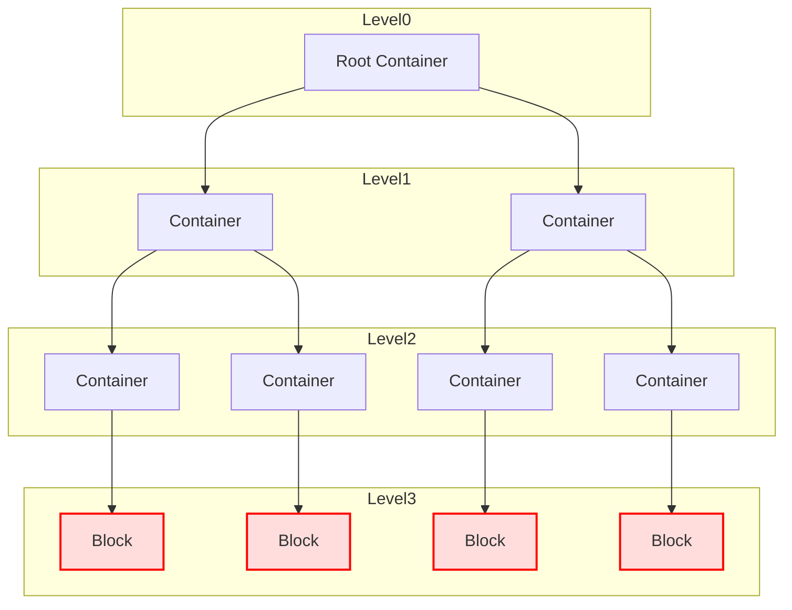

# Block

## Overview 

The Block is the leaf node of the hexamind data representation. It is the only element that can contain raw content. The Block doesn't have any behavior. 


### Rules 

The following rules are applied when creating this structure : 

- A container can contain other containers or blocks
- A block can only contain raw content and don't have any children
- A container can contain multiple children
- A block is always contained by it own parent container

### Properties

A Block, as well as a Container, inherit from the same abstract class `Element`.

The Block is the object use in the leaf node of the hexamind tree representation of a document. But it is also the object retrieve by the retriver in the vector db. Every sources retrieved is then converted to a block object, and a distance from the query is associated to it.

## Properties

**Constructor Parameters**

- `content`(str): The content of the block.
- `parent_document`(Document): The parent document of the block.
- `parent_container`(Container): The parent container of the block.
- `distance`(int): In the RAG model, represents the distance between the block and the query. 

**Attributes**

- `content`(str): The content of the block.
- `parent_document`(Document): The parent document of the block.
- `parent_container`(Container): The parent container of the block.
- `distance`(int): In the RAG model, represents the distance between the block and the query.
- `level`(int): The level of the block in the document.

## Methods

#### get_content

Return the content of the block.

#### to_dict

Return a dictionary representation of the block.

#### from_metadata

Create a block object from a metadata dictionary. This method is used to create a block object from the vector db.

**Parameters**

- `text_content`(str): The content of the block.
- `metadata`(dict): The metadata of the block.
- `meta_distance`(int): The distance of the block from the query.

**Returns**

- `Block`: The block object created from the metadata.

##### Usage Example

###### Code

```py

blocks = []
for content, metadata, distance in zip(contents, metadatas, distances):
    block = Block.from_metadata(content, metadata, distance)
    blocks.append(block)

```


