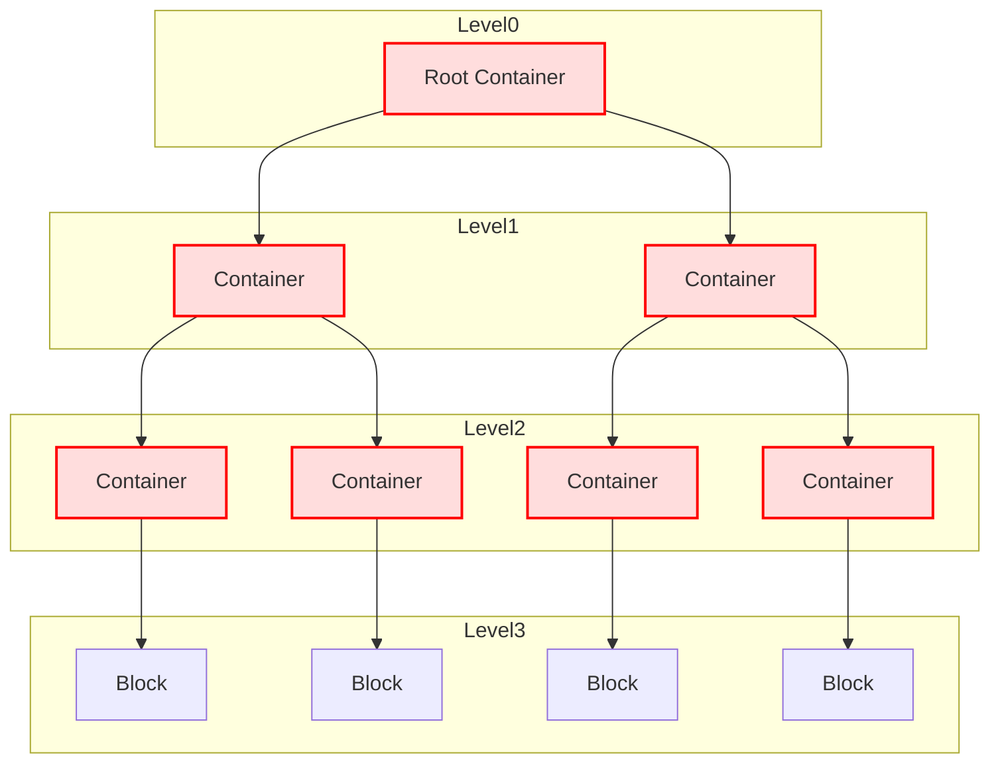

# Container

## Overview 

The container is the principal component of the hxm_rag data representation. It is a recursive structure that can contain other containers or block. 

Below is the hxm_rag representation of a document where container embark all the behavior and block embark only the raw content. 

### Rules 

The following rules are applied when creating this structure : 

- A container can contain other containers or blocks
- A block can only contain raw content and don't have any children
- A container can contain multiple children
- A block is always contained by it own parent container

### Properties

A container, as well as the block, inherit from the same abstract class `Element`.

The difference is that the container is the only element that bring with it all the behavior that can be applied on text. 
For instance a text summary will be store inside the container.

## Properties

**Constructor parameters**

- `parent_document` : The parent document of the container
- `parent_container` : The parent container of the container
- `level` : The level of the container in the document

**Attributes**

- `uid` : The unique identifier of the container. Inherited from Element class
- `parent_document` : The parent document of the container
- `parent_container` : The parent container of the container
- `parent_document_uid` : The uid of the parent document
- `parent_container_uid` : The uid of the parent container
- `children` : The children of the container
- `level` : The level of the container in the document
- `content` : The content of the container. Concatenation of all the content of the children
- `embeddings` : The embeddings of the container.
- `chunk_id` : The chunk id of the container
- `chunk` : The chunk id of the container
- `metadatas` : The metadata of the container
- `summary` : The summary of the container
- `summary_embeddings` : The embeddings of the summary
- `summary_chunk_id` : The chunk id of the summary
- `summary_chunk` : The chunk id of the summary
- `summary_metadatas` : The metadata of the summary

## Methods

#### get_content

Return the content of the container. Meaning the concatenation of all the content of the children.

#### add_child

Add a child to the container

**Parameters**

- `child` (Element): The child to add to the container

#### from_dict

classmethod to create a container from a dictionary

**Parameters**

- `structure_dict` (dict): The dictionary to create the container from
- `parent_document` (Document): The parent document of the container. Default to None
- `parent_container` (Container): The parent container of the container. Default to None

#### get_embeddings

Return the embeddings of the container

**Parameters**

- `llm_agent` (LlmAgent): The agent to use to generate the embeddings

#### get_summaries

Return the summary of the container. Populating from the container to the children. Each container will have a summary that is the summary of all the children.

**Parameters**

- `llm_agent` (LlmAgent): The agent to use to generate the summary

#### to_dict

Return a dictionary representation of the container

## Note

This class has not the purpose to be used by the user but this is still the main component of the library. Every other component could use this class when working with documents.
