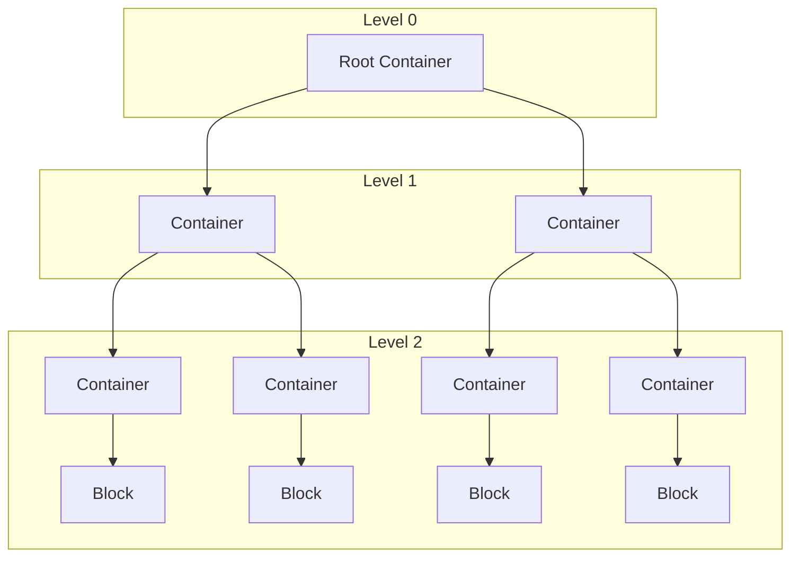

# Document

```python	
class Document(root_container: Container, title: str)
```

## Overview 

The `Document` converts a markdown content into a tree representation using `Container` and `Block` nodes. This object exposes all useful method and tool to the user to manipulate the content, create summaries, extracts chunks and more. 

Below is a representation of a document in the hexamind library. Each container node represents a section of the document and each block, at leaf node, represents a text paragraph of a section.



### Rules

The following rules are applied when creating this structure :

- A block can only contain raw content and don't have any children
- A container can contain multiple children
- A block has it own parent container

## Parameters

- `root_container` : Container

    The root container of the document. Created at instantiation using the MkBuilder class.
- `title` : str

    The title of the document. Can be None.

## Attributes

- `root_container` : Container

    The root container of the document.

- `title` : str

    The title of the document.

- `summarizer` : Summarizer

    The summarizer used to generate a summary of the document.

- `tokenizer` : ITokenizer

    The tokenizer used to extract chunks from the document. Default tokenizer is a Mistral Tokenizer. 
    
    *See [Tokenizer](tokenizer.md) for more information.*


## Methods

<div style="display: flex; flex-direction: row; justify-content: space-between; magin-bottom: 10px">
    <div style="flex: 1; padding: 8px;">
        ```python
        def get_root(self) -> Container
        ```
    </div>
    <div style="flex: 2; padding: 20px; ">
        Return the root container of the document.
    </div>
</div>

<hr style="border: none; border-top: 1px solid #ccc; margin 20px 0;">

<div style="display: flex; flex-direction: row; justify-content: space-between; magin-bottom: 10px">
    <div style="flex: 1; padding: 8px;">
        ```python
        def get_title(self) -> str
        ```
    </div>
    <div style="flex: 2; padding: 20px; ">
        Return the title of the document.
    </div>
</div>

<hr style="border: none; border-top: 1px solid #ccc; margin 20px 0;">

<div style="display: flex; flex-direction: row; justify-content: space-between; magin-bottom: 10px">
    <div style="flex: 1; padding: 8px;">
        ```python
        def get_content(self) -> str
        ```
    </div>
    <div style="flex: 2; padding: 20px; ">
        Return the content of the document as a string. The content is return as a markdown string.
    </div>
</div>

<hr style="border: none; border-top: 1px solid #ccc; margin 20px 0;">

<div style="display: flex; flex-direction: row; justify-content: space-between; magin-bottom: 10px">
    <div style="flex: 1; padding: 8px;">
        ```python
        def get_section_content(
            self, 
            section_number: str
            ) -> Optional[str]
        ```
    </div>
    <div style="flex: 2; padding: 20px; ">
        Return the content of a specific section of the document. 
    </div>
</div>

<hr style="border: none; border-top: 1px solid #ccc; margin 20px 0;">

<div style="display: flex; flex-direction: row; justify-content: space-between; magin-bottom: 10px">
    <div style="flex: 1; padding: 8px;">
        ```python
        def set_summarizer(
            self, 
            summarizer: Summarizer
            ) -> None
        ```
    </div>
    <div style="flex: 2; padding: 20px; ">
        Set a summarizer to the document. You must ensure that a summarizer is set before calling the summarize method.
    </div>
</div>

<hr style="border: none; border-top: 1px solid #ccc; margin 20px 0;">

<div style="display: flex; flex-direction: row; justify-content: space-between; magin-bottom: 10px">
    <div style="flex: 1; padding: 8px;">
        ```python
        def set_tokenizer(
            self, 
            tokenizer: ITokenizer
            ) -> None
        ```
    </div>
    <div style="flex: 2; padding: 20px; ">
        Set your own tokenizer to the document. Replacing the default one. 
    </div>
</div>

<hr style="border: none; border-top: 1px solid #ccc; margin 20px 0;">

<div style="display: flex; flex-direction: row; justify-content: space-between; magin-bottom: 10px">
    <div style="flex: 1; padding: 8px;">
        ```python
        def visualize_structure(
            self, 
            filename: str = 'document_structure'
            ) -> None
        ```
    </div>
    <div style="flex: 2; padding: 20px; ">
        Create a pdf file that can be used to visualize the tree structure of the document.  
    </div>
</div>

<hr style="border: none; border-top: 1px solid #ccc; margin 20px 0;">

<div style="display: flex; flex-direction: row; justify-content: space-between; magin-bottom: 10px">
    <div style="flex: 1; padding: 8px;">
        ```python
        def to_dict(self) -> Dict[str, Any]
        ```
    </div>
    <div style="flex: 2; padding: 20px; ">
        Serialize the tree strcuture of the document into a dictionary.
    </div>
</div>

<hr style="border: none; border-top: 1px solid #ccc; margin 20px 0;">

<div style="display: flex; flex-direction: row; justify-content: space-between; magin-bottom: 10px">
    <div style="flex: 1; padding: 8px;">
        ```python
        def get_summary(
            self, 
            section_number: Optional[str] = None, 
            level: Optional[int] = None
        ) -> Union[str, List[str]]
        ```
    </div>
    <div style="flex: 2; padding: 20px; ">
       Return a summary of the document. Can be either by level or by section number. Return either a string or a list of strings.
    </div>
</div>

<hr style="border: none; border-top: 1px solid #ccc; margin 20px 0;">

```python
    def extract_chunks(
        self, 
        strategy: str = "block",  
        callback : Optional[Callable[[Container, str], List[Chunk]]] = None
        ) -> List[Chunk]:
```

Create and extract chunks from the document. 

The strategy defined to extracts the chunk can be: 

- `block` : Extract chunks from the block level meaning that each block is a chunk.
- `section_number` : Extract chunks by section number. Meaning that the splitting is section-based.
- `level` : Extract chunks by level. Meaning that the splitting is level-based.
- `custom` : Extract chunks using a custom callback function.

The callback function must have the following signature : 

```python

def callback(container: Container, parameter: str) -> List[Chunk]:
    pass

```

<hr style="border: none; border-top: 1px solid #ccc; margin 20px 0;">


<div style="display: flex; flex-direction: row; justify-content: space-between; magin-bottom: 10px">
    <div style="flex: 1; padding: 8px;">
        ```python
        def save(self, filename: str) -> None
        ```
    </div>
    <div style="flex: 2; padding: 20px; ">
        Save the document as a markdown file.
    </div>
</div>

<hr style="border: none; border-top: 1px solid #ccc; margin 20px 0;">

## Usage Example

###### Code

```python

from hexamind.model import Document

markdown_content = """
# Title

This is a markdown content."""

document = Document(markdown_content, title="Example")

content = document.get_section_content("1")

print(content)

```

###### Output

```

This is a markdown content.

```